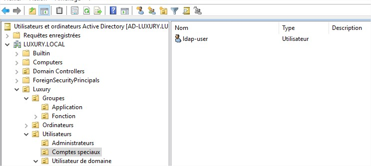
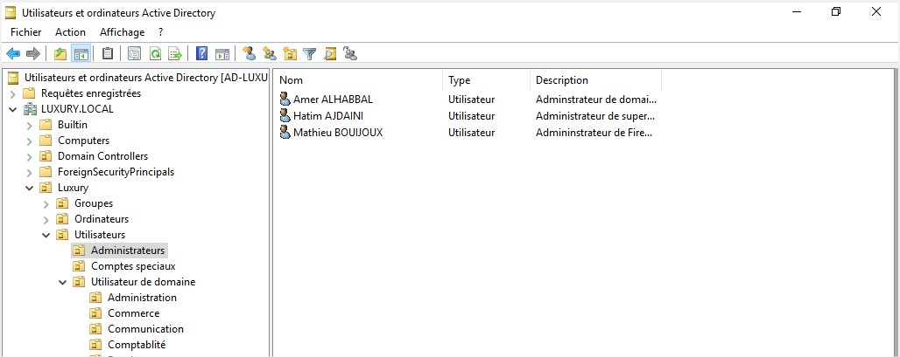

# grafana

## Description

This is my gitlab docker image with my config

## How to ?

- Run the image and container (remove -d to see the debug) :

```shell
docker-compose up -d 
```

- Go in the tty of the container :

```shell
docker exec -ti gitlab_c /bin/bash
```

- Restart server :

```shell
docker rm -f gitlab_c && docker-compose up -d
```

### Config

1. change /srv/gitlab/config/gitlab.rb (in your server and not in container)

and add change those values to :

unicorn['worker_processes'] = 4
unicorn['port'] = 8081
gitlab_git_http_server['auth_backend'] = "http://localhost:8081"

#### ldap AD config

this is how my example AD looks like :





1. change /srv/gitlab/config/gitlab.rb (in your server and not in container)

```shell
[root@docker grafana]# nano /var/lib/docker/volumes/grafana_grafana-config/_data/grafana.ini
```

2. Then add the ldap config file (for example the one in the ./config/gitlab_ldap.conf **with your AD config WITH YOUR PASSWORD !** ) in your /srv/gitlab/config/gitlab.rb :

3. restart server 

```shell
docker rm -f gitlab_c && docker-compose up -d
```

4. test your ldap config :

```shell
docker exec -ti gitlab_c /bin/bash
gitlab-rake gitlab:ldap:check
```

The ouput should be like that :

```shell
Checking LDAP ...

LDAP: ... Server: ldapmain
LDAP authentication... Success
LDAP users with access to your GitLab server (only showing the first 100 results)
        DN: cn=amer alhabbal,ou=administrateurs,ou=utilisateurs,ou=luxury,dc=luxury,dc=local     sAMAccountName: a.alhabbal
        DN: cn=accès compatible pré-windows 2000,cn=builtin,dc=luxury,dc=local   sAMAccountName: Accès compatible pré-Windows 2000
etc ...
```

### Debug

- debug only the last 100 lines of the log file :

```shell
docker logs --tail=100 --timestamps gitlab_c
```

- debug the log file permanently :

```shell
docker logs -f --tail --timestamps gitlab_c
```
