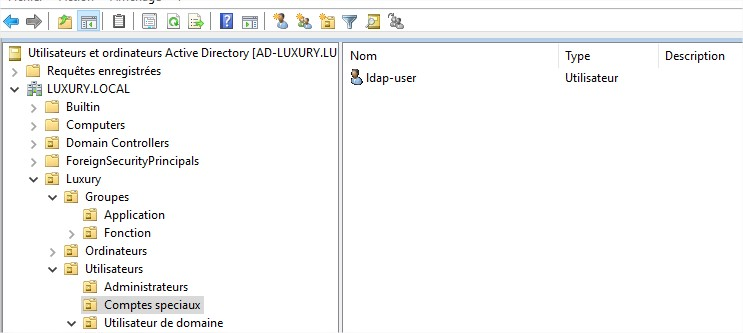
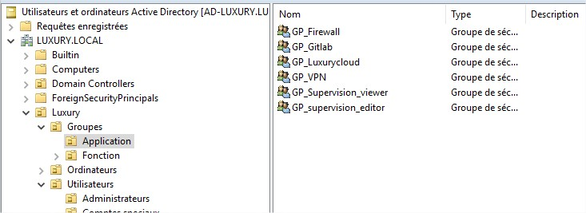

# grafana

## Description

This is my grafana docker image with influxdb

## How to ?

- Run the image and container :

```shell
chmod 770 run_app.sh
./run_app.sh
```

- Go in the tty of the container :

```shell
docker exec -ti grafana_c /bin/bash
```

- Restart server :

```shell
docker rm -f grafana_c influxdb_c && docker-compose up -d
```

### Curl commands 

- change grafana password (change all [OLD_PASSWORD] [GRAFANA_IP] [NEW_PASSWORD]) :

```shell
curl -X PUT -H "Content-Type: application/json" -d '{"oldPassword": "[OLD_PASSWORD]","newPassword": "[NEW_PASSWORD]","confirmNew": "[NEW_PASSWORD]"}' http://admin:[OLD_PASSWORD]@[GRAFANA_IP]:3000/api/user/password
```

- add grafana datasource (change [PASSWORD] [GRAFANA_IP]) :

```shell
curl --header "Content-Type: application/json"  --request POST  --data '{"name":"TelegrafDB","type":"influxdb","url":"http://influxdb_c:8086","access":"proxy","isDefault":true,"database":"TelegrafDB"}' http://admin:[PASSWORD]@[GRAFANA_IP]:3000/api/datasources
```

### Config

Find volumes paths : 

```
[root@docker grafana]# docker inspect grafana_c | grep volume
"Type": "volume",
"Source": "/var/lib/docker/volumes/grafana_grafana-config/_data",
"Type": "volume",
"Source": "/var/lib/docker/volumes/grafana_grafana-data/_data",
```

#### ldap AD config

this is how my example AD looks like :





1. change grafana.ini

```shell
[root@docker grafana]# nano /var/lib/docker/volumes/grafana_grafana-config/_data/grafana.ini
```

and add change those values to :

```config
[auth.ldap]
enabled = true
config_file = /etc/grafana/ldap.toml
allow_sign_up = true
```

2. Then modify the ldap config file (for example the one in the ./config/ldap.toml **with your AD config !** ) :

```shell
[root@docker grafana]# nano /var/lib/docker/volumes/grafana_grafana-config/_data/ldap.toml
```

3. restart server 

```shell
docker rm -f grafana_c influxdb_c && docker-compose up -d
```

#### add custom dashboard

1. go to the url : http://[CONTAINER_IP]:3000/dashboard/import

2. click in the  "Upload .json File" button then you can add for example mine the ./config/*.json

### Debug

- enable ldap debug :

```shell
[root@docker grafana]# nano /var/lib/docker/volumes/grafana_grafana-config/_data/grafana.ini
```

and change those values:

- Default values :

```config
[log]
;level = info
;filters =
```

- New values 

```config
[log]
level = debug
filters = ldap:debug
```

restart server 

```shell
docker rm -f grafana_c influxdb_c && docker-compose up -d
```

- debug only the last 100 lines of the log file :

```shell
docker logs --tail=100 --timestamps grafana_c
```

- debug the log file permanently :

```shell
docker logs -f --tail --timestamps grafana_c
```
